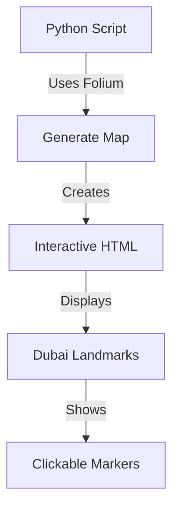
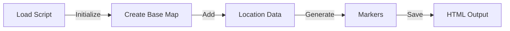

# Dubai Interactive Map Project

## Overview
This project creates an interactive web map of Dubai's key landmarks and attractions using Python and the Folium library. The map displays various important locations across Dubai with clickable markers that show the location names.

## System Architecture


## Key Workflow


## Setup and Usage

### Prerequisites
- Python 3.6 or higher
- pip (Python package installer)

### Installation Steps
1. Clone or download this repository to your local machine

2. Create and activate a virtual environment (recommended):
   ```bash
   # Windows
   python -m venv venv
   venv\Scripts\activate

   # macOS/Linux
   python3 -m venv venv
   source venv/bin/activate
   ```

3. Install required dependencies:
   ```bash
   pip install -r requirements.txt
   ```

### Running the Application
1. Run the Python script:
   ```bash
   python main.py
   ```

2. The script will generate a file named `dubai_map.html` in the same directory

3. Open `dubai_map.html` in your web browser to view the interactive map
   - You can double-click the file to open it in your default browser
   - The map is interactive - you can zoom, pan, and click markers to see location names

## Features
- Interactive web map centered on Dubai
- Markers for 10 key locations including:
  - Burj Khalifa
  - Dubai Mall
  - Dubai Fountain
  - And more
- Clickable markers with location names
- Zoomable map interface
