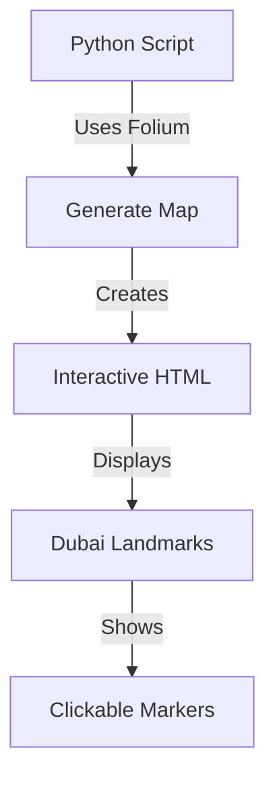
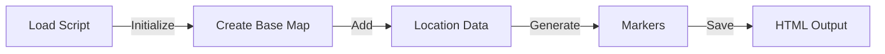

# Dubai Interactive Map Project

## Overview
This Python script generates an interactive web map of Dubai's key tourist attractions and landmarks using the Folium library. The map is centered on Dubai with a default zoom level optimized for city-wide viewing. Each location is marked with an interactive marker that displays the location name when clicked.

## System Architecture


## Key Workflow


## Technical Details
- Map centered at coordinates: [25.2048, 55.2708]
- Default zoom level: 12
- Uses Folium's OpenStreetMap tiles
- Generates a standalone HTML file with embedded JavaScript
- Interactive features powered by Leaflet.js (via Folium)

## Featured Landmarks
The map includes markers for these key Dubai locations:
1. Burj Khalifa - World's tallest building
2. Dubai Mall - One of the world's largest shopping malls
3. Dubai Fountain - World's largest choreographed fountain system
4. Jumeirah Beach - Popular public beach
5. Souk Madinat Jumeirah - Traditional Arabian marketplace
6. Dubai Creek - Historic waterway and trading hub
7. Al Fahidi Historical Neighborhood - Cultural district
8. Gold Souk - Traditional gold market
9. Spice Souk - Traditional spice market
10. Palm Jumeirah - Artificial archipelago

## Setup and Usage

### Prerequisites
- Python 3.6 or higher
- pip (Python package installer)

### Installation Steps
1. Clone or download this repository to your local machine

2. Create and activate a virtual environment (recommended):
   ```bash
   # Windows
   python -m venv venv
   venv\Scripts\activate

   # macOS/Linux
   python3 -m venv venv
   source venv/bin/activate
   ```

3. Install required dependencies:
   ```bash
   pip install -r requirements.txt
   ```

### Running the Application
1. Run the Python script:
   ```bash
   python main.py
   ```

2. The script will generate a file named `dubai_map.html` in the same directory

3. Open `dubai_map.html` in your web browser to view the interactive map
   - You can double-click the file to open it in your default browser
   - The map is interactive - you can zoom, pan, and click markers to see location names

## Output Features
The generated HTML map provides:
- Interactive zoom and pan controls
- Clickable markers that display location names
- Responsive design that works on both desktop and mobile browsers
- Ability to switch between different map views (satellite, street map)
- Mouse wheel zoom support
- Touch screen compatibility for mobile devices

## About Folium
Folium is a Python library that allows you to create interactive maps by combining the data manipulation capabilities of Python with the mapping strengths of the Leaflet.js library. It enables:
- Creation of interactive maps with Python
- Addition of markers, polygons, and popups
- Multiple base map styles
- GeoJSON and TopoJSON overlay support
